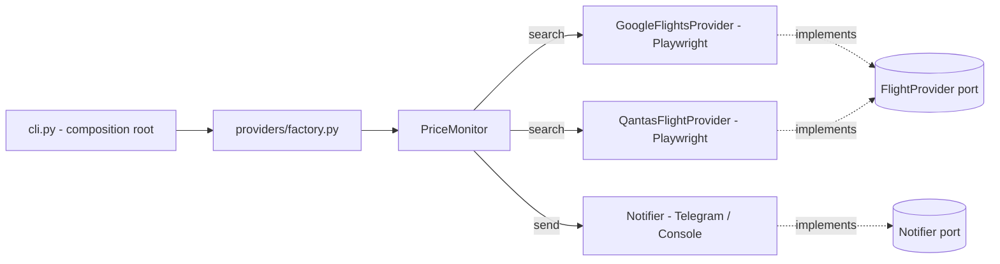

# Flight Tracker ✈️

Monitor flight prices for a route and get a **Telegram alert** when an offer
drops to or below your target.

Pre-configured out of the box for the trip:

> **SYD → ADL**, depart **8 Aug**, return **11 Aug**, **3 adults + 1 child**,
> searching **cash fares on Google Flights**.

Two providers are supported:

| Provider | Fare type | How it works | Default |
|----------|-----------|--------------|---------|
| `google` | **cash** (AUD) | Builds a Google Flights `tfs` deep-link and reads the rendered results with **Playwright**. | ✅ |
| `qantas` | **points** (Classic Rewards) or cash | Drives the public Qantas booking widget with **Playwright**. | |

Pick one with `--provider google` (default) or `--provider qantas`.

---

## Architecture

The code follows **clean / hexagonal architecture** — dependencies point
inwards, and the core has no knowledge of Playwright, Telegram or env vars.

```
src/flight_tracker/
├── domain/                     # Pure core: entities + ports (interfaces)
│   ├── entities.py             #   FlightSearchQuery, FlightOffer, ...
│   └── ports.py                #   FlightProvider, Notifier protocols
├── application/                # Use cases (orchestration only)
│   ├── price_monitor.py        #   search → filter → notify, polling loop
│   └── formatting.py           #   human-readable alert text
├── infrastructure/             # Adapters (the outside world)
│   ├── config.py               #   env-var settings (pydantic-settings)
│   ├── logging_config.py
│   ├── notifications/
│   │   ├── telegram.py         #   Telegram Bot API notifier
│   │   └── console.py          #   stdout fallback notifier
│   └── providers/
│       ├── factory.py                    #   build_provider(name, ...)
│       ├── google_flights_playwright.py  #   Google Flights scraper (default)
│       ├── google_flights_tfs.py         #   tfs deep-link URL builder
│       ├── google_flights_selectors.py   #   result-row selectors
│       ├── qantas_playwright.py          #   Qantas scraper (points)
│       └── qantas_selectors.py           #   centralised, tunable selectors
└── cli.py                      # Composition root + CLI entry point
```

| Layer | Depends on | Allowed to import |
|-------|------------|-------------------|
| `domain` | nothing | stdlib only |
| `application` | `domain` | stdlib only |
| `infrastructure` | `domain` | third-party SDKs |
| `cli` | all | wires everything together |

This makes the use case fully unit-testable with in-memory fakes (see
`tests/`), and lets you add another source by writing one new adapter that
implements `FlightProvider` and registering it in `providers/factory.py`.

---

## Quick start (local)

Requires **Python 3.11+**.

```bash
# 1. Create a virtual environment
python -m venv .venv && source .venv/bin/activate

# 2. Install the package (+ dev tools) and the Chromium browser
make dev          # or: pip install -e ".[dev]"
make browsers     # or: python -m playwright install chromium

# 3. Configure
cp .env.example .env
#   edit .env: set TELEGRAM_BOT_TOKEN / TELEGRAM_CHAT_ID (and tweak the search)

# 4. Run a single check, printing to the console (no Telegram needed)
make once         # or: flight-tracker --once --console
```

When you're happy, start the watcher (polls and alerts via Telegram):

```bash
flight-tracker            # uses .env defaults (SYD→ADL, 3+1, cash, Google Flights)
```

---

## Usage

CLI flags override `.env` defaults:

```bash
flight-tracker \
  --provider google \
  --origin SYD --destination ADL \
  --depart 2026-08-08 --return 2026-08-11 \
  --adults 3 --children 1 \
  --fare-type cash --target 800 \
  --interval 1800
```

| Flag | Description | Default |
|------|-------------|---------|
| `--provider` | `google` (cash) or `qantas` (points/cash) | `google` |
| `--origin` / `--destination` | 3-letter IATA codes | `SYD` / `ADL` |
| `--depart` / `--return` | `YYYY-MM-DD` (omit `--return` for one-way) | 8 Aug / 11 Aug |
| `--adults` / `--children` / `--infants` | passenger counts | `3` / `1` / `0` |
| `--cabin` | `economy`, `premium_economy`, `business`, `first` | `economy` |
| `--fare-type` | `cash` or `points` (Classic Rewards) | `cash` |
| `--target` | alert threshold — AUD or points per `--fare-type` | `300` |
| `--once` | run a single check and exit | off (polls) |
| `--interval` | seconds between checks when polling | `1800` |
| `--max-checks` | stop after N checks | unlimited |
| `--no-headless` | show the browser (debug selectors) | headless |
| `--console` | print alerts instead of sending Telegram | off |

> **Note:** `--fare-type points` is only supported by `--provider qantas`.
> Google Flights tracks cash fares only.

The watcher stops after the first successful alert. Remove that behaviour by
adjusting `notify_once` in `PriceMonitor.run_forever` if you want continuous
alerting.

---

## Telegram setup

1. Message **@BotFather**, send `/newbot`, and copy the **bot token**.
2. Send any message to your new bot.
3. Visit `https://api.telegram.org/bot<TOKEN>/getUpdates` and copy the
   `chat.id` value.
4. Put both into `.env`:

   ```dotenv
   TELEGRAM_BOT_TOKEN=123456:ABC-DEF...
   TELEGRAM_CHAT_ID=987654321
   ```

If Telegram is not configured, the app automatically falls back to printing
alerts to the console.

---

## Tracking reward points (Qantas provider)

Google Flights only shows **cash** fares. To track **Qantas Classic Reward
points** instead, switch providers:

```bash
flight-tracker --provider qantas --fare-type points --target 55000
```

Qantas shows **full Classic Reward availability and points pricing to
logged-in Frequent Flyer members**. To let the scraper see those prices,
capture a session once:

```bash
python scripts/capture_qantas_session.py qantas_session.json
# A browser opens — log in, then press Enter in the terminal.
```

Then point the app at it:

```dotenv
QANTAS_STORAGE_STATE=qantas_session.json
```

The session JSON contains cookies — treat it like a secret. It is git-ignored
by default (see `.gitignore`).

---

## Docker

```bash
# Build
docker build -t flight-tracker:latest .

# One-off check, console output
docker run --rm --env-file .env flight-tracker:latest --once --console

# Long-running watcher with Telegram alerts (docker compose)
docker compose up --build -d
docker compose logs -f
```

The image is based on Microsoft's official Playwright Python image, so
Chromium and all OS dependencies are pre-installed. Failure screenshots are
written to the mounted `./screenshots` directory for debugging.

---

## Testing & quality

```bash
make test        # pytest (unit tests, no network/browser needed)
make lint        # ruff
make typecheck   # mypy --strict
```

The domain and application layers are covered by fast, dependency-free unit
tests using in-memory fakes for the `FlightProvider` and `Notifier` ports.

---

## How it works

1. **Config** is loaded from environment variables / `.env`
   (`infrastructure/config.py`).
2. The **composition root** (`cli.py`) asks `providers/factory.py` for the
   chosen provider, builds a notifier (Telegram or console), and a
   `PriceMonitor`.
3. For Google Flights, the provider encodes the search as a `tfs` protobuf
   deep-link (`google_flights_tfs.py`), navigates straight to the results
   page, and parses each row.
4. `PriceMonitor.check_once` calls the provider, filters offers at/below the
   target, and sends a formatted alert through the notifier.
5. `run_forever` repeats on an interval, retrying after provider errors.



---

## Maintaining the selectors

Both Google Flights and Qantas are client-rendered sites whose markup changes
often. Selectors live alongside each provider
(`google_flights_selectors.py`, `qantas_selectors.py`). If a scraper stops
finding results:

1. Run with `--no-headless` to watch the flow.
2. Check the failure screenshot in `screenshots/`.
3. Update the relevant selector(s); each one already lists fallbacks.

---

## Notes & responsible use

- This tool automates websites **you are entitled to use for your own
  bookings**. Respect each site's Terms of Use, keep polling intervals
  conservative (the default is 30 minutes), and don't run many watchers in
  parallel.
- Fares and reward availability can change between checks; always confirm on
  the airline / Google Flights before booking.
- Secrets (Telegram token, session cookies) are only ever read from the
  environment / local files, never committed.

## License

MIT
